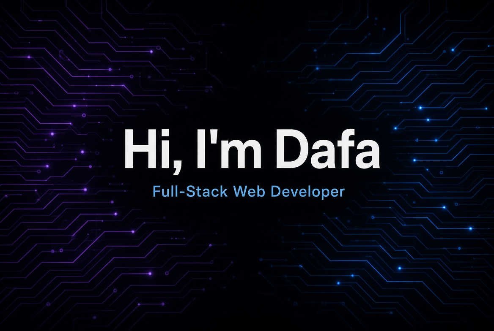
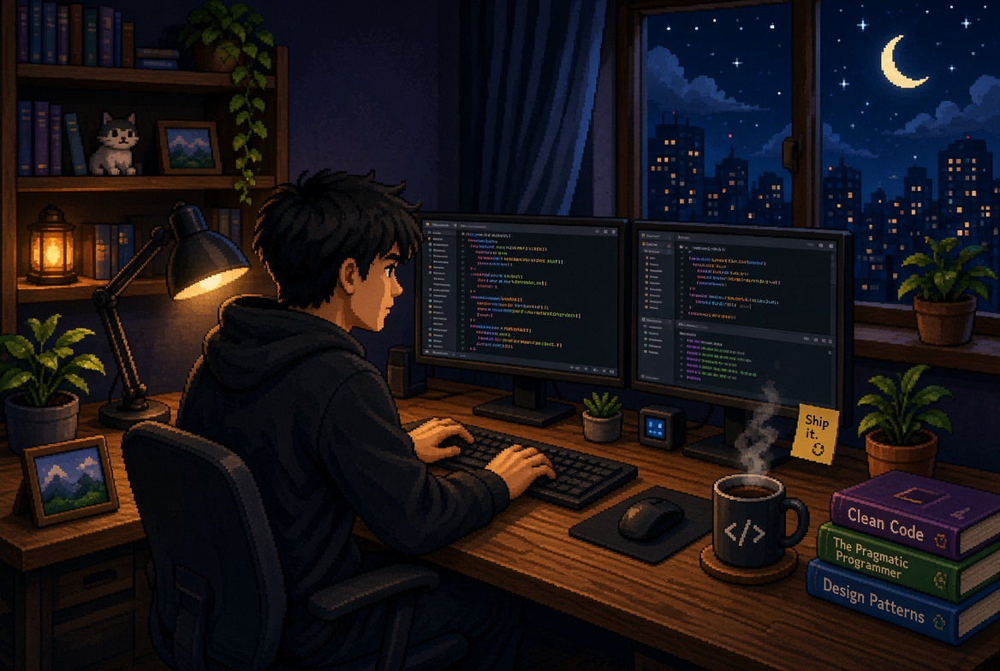

  

 

  

 

I'm **Dafa Adi Raharjo**, an Informatics Engineering graduate with a strong interest in full-stack web development.  
I enjoy building practical web applications from backend systems and database design to modern, user-friendly frontend experiences.

I focus on creating clean, maintainable, and functional software. My main stack includes **Laravel**, **Next.js**, **TypeScript**, **PHP**, and **Python**.  
As a continuous learner, I thrive in dynamic environments and always open to exploring new technologies and best practices in software engineering.

  
  
  
  
  

---

### Core Tech Stacks

  

### Other Tech Stacks

  

### Tools

  

---

### Featured Projects

| Project | Description | Tech |
| -------------------------------- | --------------------------------------------------------------------------------- | ---------------------------------------- |
| [**SITEMAN-SUCA**](https://github.com/dafa30/persuratan) | Correspondence Management System with role-based access & document classification | Laravel 11 · PHP · MySQL · Tailwind |
| [**Digital Wedding Invitation**](https://github.com/dafa30/undangan-pernikahan) | Interactive invitation with RSVP, real-time wishes & AI polishing | Next.js · TypeScript · Supabase · Gemini |
| [**Odoo 19 Smart POS**](https://github.com/dafa30/odoo19-workshop) | Custom POS module with Loyalty Point system | Odoo 19 · Python · Docker |
| [**Tourism Ticket Booking**](https://github.com/dafa30/ticketing_wisata) | Ticket booking system with invoice generation | PHP · MySQL · JavaScript |
| [**Internal Helpdesk**](https://github.com/dafa30/aplikasi_helpdesk) | Role-based helpdesk for ticket management | PHP Native · MySQL · Bootstrap |

---

### GitHub Statistics

  
  

### GitHub Contributions

  

  

---

